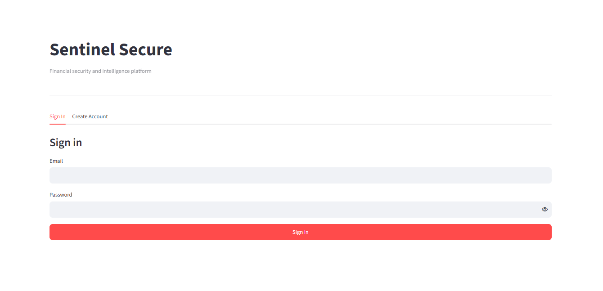
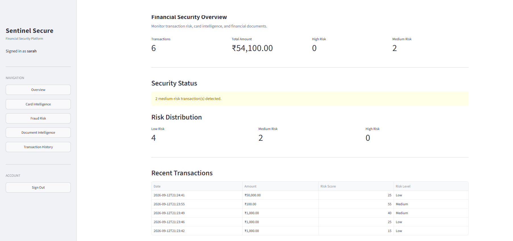
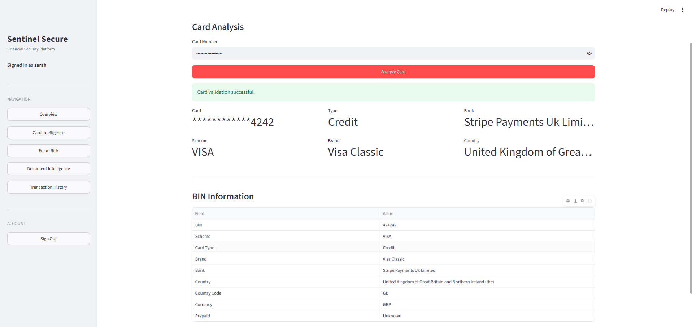
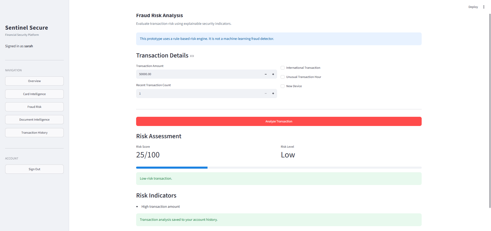

# Sentinel Secure

A financial security and intelligence platform built with **Python, Streamlit, SQLite, REST APIs, FAISS, and Google Gemini**.

Sentinel Secure combines user authentication, card intelligence, explainable transaction risk analysis, document Q&A, and transaction history in a single dashboard.

---

## Features

### 🔐 User Authentication

- User registration and login
- Email validation
- Password hashing with bcrypt
- Session-based authentication
- User-specific transaction history
- SQLite persistence



---

### 📊 Security Dashboard

Provides a centralized view of financial security activity, including:

- Total analyzed transactions
- Transaction amount
- Risk distribution
- Recent activity
- Overall security status



---

### 💳 Card Intelligence

Performs card validation and retrieves publicly available BIN information.

**Includes:**
- Luhn validation
- Card number masking
- BIN extraction
- Card scheme and type
- Issuing bank
- Country and currency
- Prepaid card detection

Uses a public BIN lookup REST API for card metadata.



> For testing, use publicly available test card numbers. Never enter real payment-card information.

---

### 🛡️ Fraud Risk Analysis

Uses an **explainable rule-based scoring engine** to evaluate transaction risk.

Risk indicators include:

- Transaction amount
- Recent transaction count
- International transaction
- Unusual transaction hour
- New device

| Score | Risk |
|------:|------|
| 0–29 | Low |
| 30–59 | Medium |
| 60–100 | High |

The system also displays the factors contributing to the risk score.



> This is a rule-based prototype, not a production machine-learning fraud detection system.

---

### 📄 Document Q&A

Uses **Retrieval-Augmented Generation (RAG)** to answer questions about uploaded financial and business documents.

**Pipeline:**

```text
PDF
 ↓
Text Extraction
 ↓
Text Chunking
 ↓
Gemini Embeddings
 ↓
FAISS Similarity Search
 ↓
Relevant Context
 ↓
Google Gemini
 ↓
Answer

Technologies:

PyPDF
LangChain
Gemini Embeddings
FAISS
Google Gemini

Users can ask natural-language questions about the uploaded document, with relevant document content retrieved before generating the answer.

📜 Transaction History

Analyzed transactions are stored in SQLite and associated with the logged-in user.

The history includes:

Date
Amount
Transaction count
Transaction indicators
Risk score
Risk level

System Architecture
                    Sentinel Secure
                           |
        +------------------+------------------+
        |                  |                  |
 Authentication     Financial Tools     Document Q&A
        |                  |                  |
      SQLite        +------+-------+           |
                     |              |          |
                  Card BIN     Fraud Engine    |
                     |              |          |
                     +------+-------+      RAG Pipeline
                            |                  |
                     Transaction History       |
                                               |
                                  Gemini + FAISS
Project Structure
SENTINEL-SECURE/
│
├── app.py
├── auth.py
├── database.py
├── card_service.py
├── fraud_engine.py
├── rag_engine.py
├── requirements.txt
├── .env.example
├── .gitignore
│
├── assets/
│   └── screenshots/
│       ├── login.png
│       ├── Overview.png
│       ├── card-intelligence.png
│       ├── fraud-risk.png
│       ├── document-qa.png
│       └── transaction-history.png
│
└── sentinel_secure.db
Technologies
Category	Technologies
Frontend	Streamlit
Backend	Python, SQLite
Authentication	bcrypt, Streamlit Session State
APIs	REST API, Python Requests
Document Q&A	PyPDF, LangChain, FAISS, Google Gemini
Development	Git, GitHub
Installation
1. Clone the repository
git clone https://github.com/23f3001950/Sentinel-Secure-AI.git
cd Sentinel-Secure-AI
2. Create a virtual environment
python -m venv .venv

Windows:

.\.venv\Scripts\Activate.ps1
3. Install dependencies
pip install -r requirements.txt
4. Configure environment variables

Create a .env file:

GOOGLE_API_KEY=your_google_gemini_api_key
NGROK_AUTH_TOKEN=your_ngrok_auth_token

Never commit your actual .env file.

5. Run the application
python -m streamlit run app.py
Security
Passwords are hashed using bcrypt.
Card numbers are masked before displaying results.
API credentials are stored in environment variables.
SQLite database is excluded from version control.
User transactions are associated with individual accounts.
Limitations
Fraud detection currently uses rule-based scoring.
PDF Q&A primarily relies on extracted text.
Images and charts inside PDFs are not directly interpreted.
The project is a prototype, not a production banking system.
Gemini API availability depends on Google API project/account configuration.
Future Improvements
ML-based fraud detection
Transaction anomaly detection
Multimodal document understanding
Table and chart extraction
Document citations and page references
PostgreSQL integration
REST backend
Role-based access control
Email verification and password reset
Audit logging
Cloud deployment
Disclaimer

Sentinel Secure is an educational and portfolio project demonstrating financial security concepts, API integration, authentication, explainable risk scoring, and RAG.

It is not intended to process real payment-card information, make financial decisions, or replace production banking security systems.

Use synthetic or publicly available test data for demonstrations.

Author

Sarah Sameera Peruka