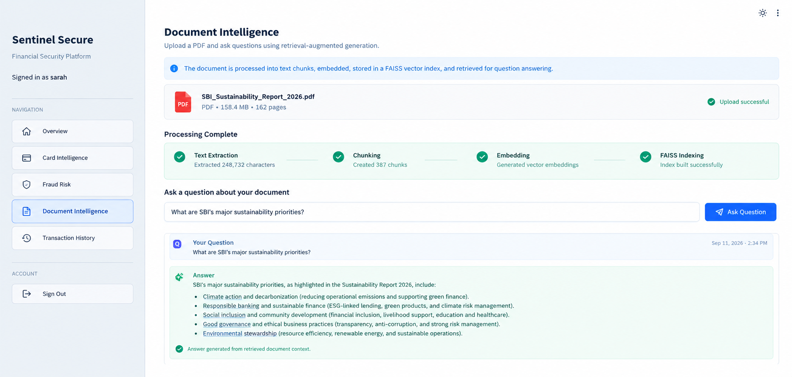
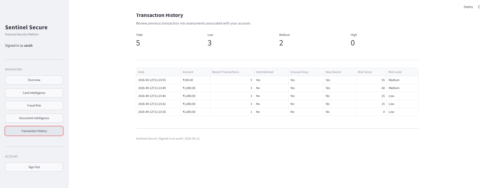

````markdown
# Sentinel Secure

A financial security and intelligence platform built with Streamlit, Python, SQLite, REST APIs, FAISS, and Google Gemini.

Sentinel Secure combines card intelligence, explainable transaction risk analysis, document-based question answering, authentication, and transaction history into a single financial security dashboard.

---

## Features

### 1. User Authentication

- User registration and login
- Email validation
- Password hashing using bcrypt
- Session-based authentication using Streamlit session state
- User-specific transaction history
- SQLite database for persistent user data

**Screenshot:**


---

### 2. Financial Security Dashboard

The dashboard provides a centralized view of the user's financial security activity.

It displays:

- Total analyzed transactions
- Total transaction amount
- High-risk transactions
- Medium-risk transactions
- Low-risk transactions
- Recent transaction activity
- Overall security status

**Screenshot:**


---

## 3. Card Intelligence

The Card Intelligence module performs card-number validation and retrieves publicly available BIN information.

### Capabilities

- Luhn algorithm validation
- Card number masking
- BIN extraction
- Card scheme detection
- Card type identification
- Card brand information
- Issuing bank information
- Country information
- Currency information
- Prepaid card identification

The application uses the BIN lookup service to retrieve publicly available card metadata.

### Processing Flow

```text
Card Number
     |
     v
Luhn Validation
     |
     v
Extract BIN
     |
     v
BIN Lookup API
     |
     v
Card Metadata
     |
     v
Masked Result
````

**Screenshot:**


> For testing, use publicly available test card numbers. Never enter real payment-card information into the application.

---

# 4. Fraud Risk Analysis

The Fraud Risk module evaluates transaction risk using an explainable rule-based scoring engine.

### Risk indicators

The system considers:

* Transaction amount
* Number of recent transactions
* International transaction status
* Unusual transaction hour
* New device

### Risk scoring

Each indicator contributes to a risk score.

```text
Transaction Details
        |
        v
Risk Indicators
        |
        v
Rule-Based Scoring
        |
        v
Risk Score (0-100)
        |
        v
Low / Medium / High
```

### Risk Levels

|  Score | Risk Level |
| -----: | ---------- |
|   0–29 | Low        |
|  30–59 | Medium     |
| 60–100 | High       |

The system also provides the reasons that contributed to the risk score.

For example:

```text
Risk Score: 65

Risk Level: High

Indicators:
- High transaction amount
- International transaction
- New device
```

**Screenshot:**


> This module is a rule-based prototype and should not be represented as a production machine-learning fraud detection system.

---

# 5. Document Intelligence

Sentinel Secure includes a Retrieval-Augmented Generation (RAG) pipeline for interacting with financial and business documents.

Users can upload a PDF and ask questions about its contents.

### RAG Pipeline

```text
PDF Document
     |
     v
Text Extraction
     |
     v
Text Chunking
     |
     v
Gemini Embeddings
     |
     v
FAISS Vector Store
     |
     v
Similarity Search
     |
     v
Relevant Context
     |
     v
Google Gemini
     |
     v
Generated Answer
```

### Technologies Used

* PyPDF for PDF text extraction
* LangChain for RAG orchestration
* Recursive text splitting
* Google Gemini embeddings
* FAISS for vector similarity search
* Google Gemini for question answering

---

### Document Processing

After uploading a document, the application processes it through the RAG pipeline.

The document is:

1. Extracted into text
2. Divided into manageable chunks
3. Converted into vector embeddings
4. Stored in a FAISS vector index
5. Retrieved based on the user's question

---

### Document Question Answering

Users can ask natural-language questions about the uploaded document.

Example:

```text
Question:
What are the major sustainability priorities
mentioned in the report?

Answer:
The report discusses sustainability priorities
covering environmental responsibility, sustainable
finance, social impact, governance, and climate-related
initiatives.
```

The system retrieves relevant document chunks before generating the answer.

**Screenshot — Document Q&A:**



---

# 6. Transaction History

Every analyzed transaction is stored in the user's SQLite database.

The transaction history contains:

* Transaction date
* Transaction amount
* Recent transaction count
* International transaction indicator
* Unusual-hour indicator
* New-device indicator
* Risk score
* Risk level

This allows users to review previously analyzed transactions.

**Screenshot:**



---

# System Architecture

```text
                    Sentinel Secure
                           |
        +------------------+------------------+
        |                  |                  |
        v                  v                  v
 Authentication      Financial Tools    Document Intelligence
        |                  |                  |
        v                  |                  v
     SQLite          +-----+-----+        PDF Upload
                     |           |             |
                     v           v             v
                 Card BIN    Fraud Engine  Text Extraction
                  Lookup         |              |
                     |           |              v
                     |           |          Text Chunking
                     |           |              |
                     |           |              v
                     |           |      Gemini Embeddings
                     |           |              |
                     |           |              v
                     |           |          FAISS Index
                     |           |              |
                     |           |              v
                     |           |        Similarity Search
                     |           |              |
                     |           |              v
                     |           |        Google Gemini
                     |           |              |
                     |           |              v
                     |           |            Answer
                     |           |
                     +-----+-----+
                           |
                           v
                   Transaction History
```

---

# Project Structure

```text
SENTINEL-SECURE/
│
├── app.py
├── auth.py
├── database.py
├── card_service.py
├── fraud_engine.py
├── rag_engine.py
│
├── requirements.txt
├── .env
├── .env.example
├── .gitignore
│
├── assets/
│   └── screenshots/
│       ├── login.png
│       ├── overview.png
│       ├── card-intelligence.png
│       ├── fraud-risk.png
│       ├── document-upload.png
│       ├── document-processing.png
│       ├── document-qa.png
│       └── transaction-history.png
│
└── sentinel_secure.db
```

---

# Technologies Used

## Frontend

* Streamlit

## Backend

* Python
* SQLite

## Authentication

* bcrypt
* Session-based authentication

## Financial APIs

* BIN lookup API
* REST API requests using Python Requests

## Document Intelligence

* PyPDF
* LangChain
* FAISS
* Google Gemini API

## Development

* Git
* GitHub
* Python virtual environment

---

# Installation

## 1. Clone the repository

```bash
git clone https://github.com/23f3001950/SENTINEL-SECURE.git
cd SENTINEL-SECURE
```

---

## 2. Create a virtual environment

### Windows

```powershell
python -m venv .venv
```

Activate it:

```powershell
.\.venv\Scripts\Activate.ps1
```

---

## 3. Install dependencies

```powershell
pip install -r requirements.txt
```

---

# Environment Variables

Create a `.env` file in the project root:

```env
GOOGLE_API_KEY=your_google_gemini_api_key
NGROK_AUTH_TOKEN=your_ngrok_auth_token
```

Do not commit your actual `.env` file.

Use `.env.example` as the template:

```env
GOOGLE_API_KEY=
NGROK_AUTH_TOKEN=
```

---

# Running the Application

Run the Streamlit application:

```powershell
python -m streamlit run app.py
```

Or, when using the project's virtual environment:

```powershell
.\.venv\Scripts\python.exe -m streamlit run app.py
```

The application will open in the browser.

---

# Database Design

Sentinel Secure uses SQLite for lightweight persistent storage.

## Users Table

```text
users
├── id
├── username
├── email
├── password_hash
└── created_at
```

## Transactions Table

```text
transactions
├── id
├── user_id
├── amount
├── transaction_count
├── international
├── unusual_hour
├── new_device
├── risk_score
├── risk_level
└── created_at
```

The `user_id` establishes the relationship between users and their transaction analyses.

---

# Security Considerations

The project includes several security-oriented design decisions.

### Password Security

Passwords are never stored directly.

Instead:

```text
Password
   |
   v
bcrypt
   |
   v
Password Hash
   |
   v
SQLite
```

### Card Data Protection

Card numbers are masked before displaying results.

Example:

```text
************4242
```

Only publicly available BIN metadata is retrieved.

### Environment Variables

API credentials are stored in `.env` rather than being hard-coded into source files.

### Database Protection

The SQLite database is excluded from version control.

```gitignore
.env
.env.*
sentinel_secure.db
```

---

# Design Decisions

## Why SQLite?

SQLite was selected because:

* Lightweight
* Serverless
* Easy to configure
* Suitable for a prototype
* Supports relational data
* Requires minimal infrastructure

## Why FAISS?

FAISS provides efficient vector similarity search and is suitable for building a local prototype RAG retrieval layer.

## Why RAG?

RAG allows the system to retrieve relevant information from a user's uploaded document before generating an answer.

This helps ground the response in the document rather than relying only on the language model's general knowledge.

## Why Rule-Based Fraud Detection?

The current fraud module intentionally uses an explainable rule-based scoring approach.

This makes it:

* Easy to understand
* Easy to debug
* Deterministic
* Transparent to users

A production system could later replace or complement this engine with a trained machine-learning model.

---

# Example Workflow

```text
1. User creates an account
           |
           v
2. User signs in
           |
           v
3. Dashboard becomes available
           |
           +----------------------+
           |                      |
           v                      v
   Card Intelligence        Fraud Risk Analysis
           |                      |
           v                      v
      BIN Metadata          Risk Score + Reasons
                                  |
                                  v
                         Transaction History

           +
           |
           v
   Document Intelligence
           |
           v
       Upload PDF
           |
           v
      Build FAISS Index
           |
           v
       Ask Question
           |
           v
      Retrieve Context
           |
           v
       Gemini Answer
```

---

# Current Limitations

* Fraud detection currently uses rule-based scoring rather than a trained ML model.
* PDF processing primarily relies on extracted text.
* Images and visual elements inside PDFs are not directly interpreted by the current pipeline.
* The application is designed as a prototype and is not a production banking system.
* Gemini API availability depends on the Google API project and account configuration.
* SQLite is suitable for this prototype but a production deployment would typically use a managed relational database.
* Authentication is implemented for the application prototype and would require additional security controls for production deployment.

---

# Future Improvements

Potential improvements include:

* Machine-learning-based fraud detection
* User transaction anomaly detection
* Advanced risk scoring
* Multimodal document understanding
* Table and chart extraction
* Document citation and page references
* Persistent vector databases
* Role-based access control
* Password reset functionality
* Email verification
* Audit logging
* Production-grade authentication
* PostgreSQL integration
* REST API backend
* Automated security monitoring
* Cloud deployment
* Model evaluation and monitoring

---

# Screenshots

## Login


---

## Dashboard


---

## Card Intelligence


---

## Fraud Risk Analysis


---


## Document Question Answering


---

## Transaction History


---

# Disclaimer

Sentinel Secure is an educational and portfolio project demonstrating financial security concepts, API integration, authentication, explainable risk scoring, and retrieval-augmented generation.

It is not intended to process real payment-card information, make real financial decisions, or replace production banking security systems.

For demonstrations, use synthetic or publicly available test data only.

---

# Author

**Sarah Sameera Peruka**

Computer Science Engineering
BVRIT Hyderabad College of Engineering for Women

Interests:

* Software Engineering
* Data Science
* Machine Learning
* Backend Development
* Agentic AI
* Financial Technology

---

# License

This project is intended for educational and portfolio purposes.

````

### Screenshot folder

Create this folder in your repo:

```text
assets/
└── screenshots/
````

Then eventually put your images there with exactly these names:

```text
login.png
overview.png
card-intelligence.png
fraud-risk.png
document-upload.png
document-processing.png
document-qa.png
transaction-history.png
```
